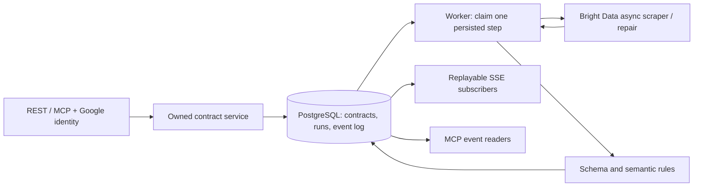
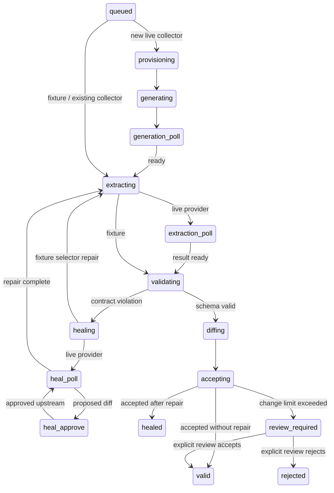

# Architecture and failure walkthrough

## Why two processes?

An HTTP request's lifetime should not determine whether an extraction finishes. The API only validates input, checks ownership and commits a queued run. The worker claims a run, executes one state transition and releases the lease. Provider polling sleeps in PostgreSQL via `availableAt`, not in a long-running request.

## Run state machine

Any state can fail on timeout or an unrecoverable error. Repeated schema violations exhaust the repair budget and escalate. Side-effect states first write a `*_submitting` marker; recovery from this marker becomes `indeterminate` because the provider might already have processed the request. Human reconciliation prevents accidental duplicate jobs and charges. Known provider job IDs survive polling retries.

## Ownership, transactions and delivery

Every external REST/MCP operation resolves a principal and passes its user ID to the same service layer. Worker entry points are internal. Credentials are hashed at rest. Old unowned contracts are never implicitly claimed by the first person to log in.

A contract row lock serializes enqueue, mutation and state changes. A lease token fences stale workers; expiry is checked at commit, and every provider request has a shorter timeout than the lease. Scheduler replicas recheck due time while holding the contract lock. Idempotency keys are scoped to contracts and remain valid after a run completes.

The event table doubles as a transactional outbox and durable pub/sub log. A state transition and its events commit atomically. Per-contract publication is serialized before sequence allocation, preserving commit order for cursor readers. Subscribers read independently and reconnect using a sequence. Delivery is replayable and can be repeated: consumers deduplicate by event sequence. There is no separate broker acknowledgment or background webhook sender.

## What proves healing?

The fixture adapter stores actual HTML and selector mappings per contract. The layout mutation changes element IDs while retaining semantic `data-field` attributes. The old selectors stop resolving, validation produces field violations, and repair discovers stable semantic selectors. The worker then runs extraction again. Removed source values cannot be repaired by inventing a replacement, so that scenario exhausts the repair budget.

The live adapter asks Bright Data to refactor its scraper and waits for completion after approval. An upstream approval is not local acceptance: schema and semantic checks still run before the latest data pointer can change. This version does not clone upstream scrapers or restore a previous upstream template.

A price change from 100 to 110 is meaningful but acceptable under a 50% limit; 100 to 900 needs review. A formatting-only title change can normalize to equality. An `expectedValue` protects a known product identity; a numeric bound rejects an impossible negative price. These are explicit domain rules, not a claim to understand arbitrary text or prove every scraped value.

## Failure exercises

1. Start two workers and enqueue with the same idempotency key twice: one run is created.
2. Kill a worker during an ordinary persisted state: after the two-minute lease expires, another worker continues. The old token cannot commit.
3. Interrupt an external submission: the recovered run pauses as indeterminate, requiring provider reconciliation.
4. Break a fixture layout: the event log records violation, healing, re-extraction and acceptance using the same database run ID.
5. Remove the required source elements: three repair attempts fail, scheduling pauses, and last accepted data remains available.
6. Change a numeric value beyond its limit: candidate data is quarantined. Accept/reject it through the review endpoint, then explicitly resume scheduling if appropriate.
7. Reconnect an SSE client with `Last-Event-ID`: events resume after that cursor even from another API process.
8. Revoke an API token: future requests and the next SSE authentication check reject it.

## Operating limits

This implementation targets one entity per URL, bounded extraction runs and small-to-moderate subscription counts. One worker processes one short step at a time; run additional workers for concurrency. Persistent event history currently needs an operator-defined retention policy. SSE readers poll PostgreSQL every second. General document semantics, multi-record datasets, isolated upstream repair versions and outbound webhook delivery are future extensions.

## Provider references

- [Bright Data AI flow](https://docs.brightdata.com/api-reference/scraper-studio-api/ai-flow/overview)
- [Batch trigger](https://docs.brightdata.com/api-reference/scraper-studio-api/Trigger_a_scraper_for_batch_collection_method)
- [Batch results](https://docs.brightdata.com/api-reference/scraper-studio-api/Receive_batch_data)
- [Repair approval](https://docs.brightdata.com/api-reference/scraper-studio-api/ai-flow/resume-self-healing-job)
- [Google OpenID Connect](https://developers.google.com/identity/openid-connect/openid-connect)
